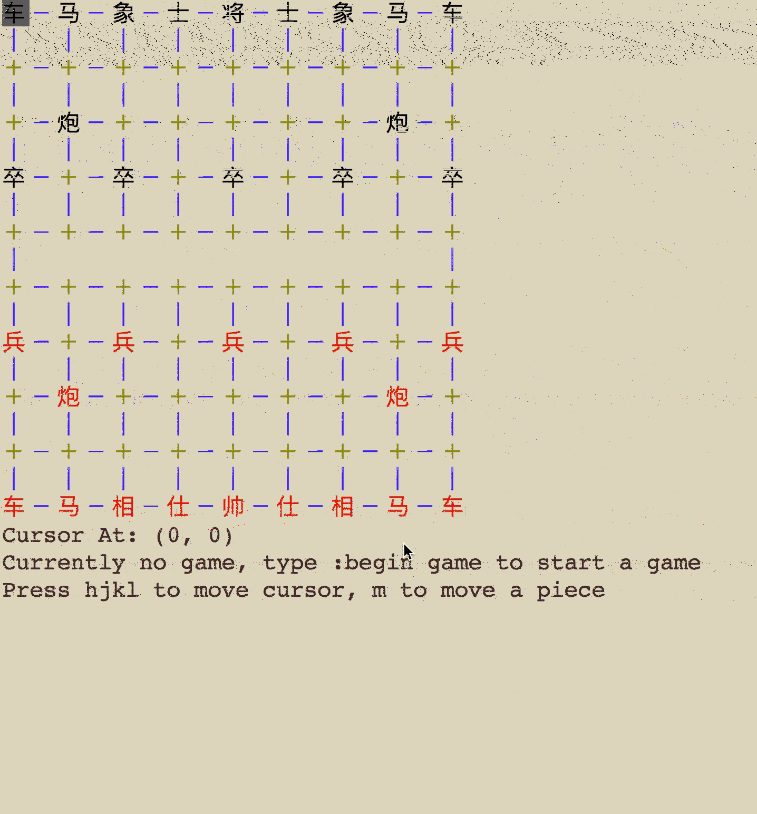

# chinesechess

This program implements game Xiangqi, with minimax algorithms. 
Good for use with 2 players, 1 player and 1 AI, or two AIs.

The game uses familiar VI key bindings.
`hjkl` to move left, down, up right.
`u` and `ctrl-R` to undo and redo.
`m` to move, `y` to confirm and `n` to cancel.

Instructions are given in the game.

The game has a command system to enable/disable AI and controll the game play.
Type `:help` to show list of commands.


Note that the game hides the terminal cursor. Please use `ctrl-D` or `:quit`
to quit the game instead of `ctrl-C`.


## Demo



## Install

### On macOS

1. Install Brew 

2. Install Haskell Platform

3. Install Stack

4. Run `stack install`

5. Run `chinesechess-exe`.

```

# Get Homebrew
/usr/bin/ruby -e "$(curl -fsSL https://raw.githubusercontent.com/Homebrew/install/master/install)"

# Install Haskell and Stack
brew cask install haskell-platform
brew install curl
curl -sSL https://get.haskellstack.org/ | sh
stack setup

# Download
git clone https://github.com/UltimatePea/ChineseChess.git
cd ChineseChess

# Install this software
stack install
chinesechess-exe
```


